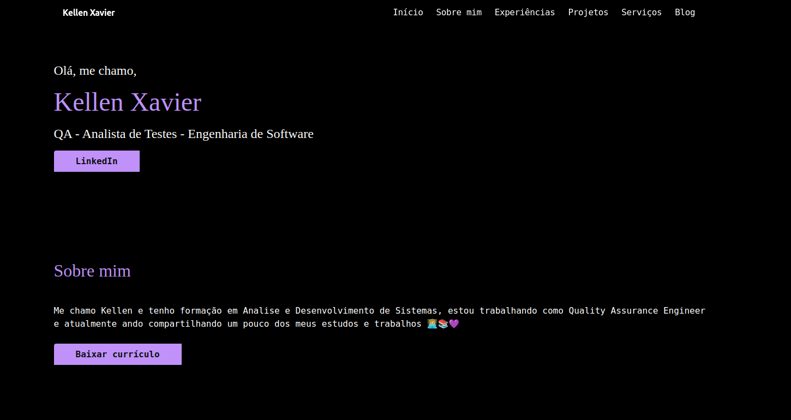

# Meu Portfolio!

Este é o meu portfólio pessoal, desenvolvido com Next.js, onde apresento minhas habilidades, experiências profissionais e projetos.

## Link do projeto
[Segue aqui o link :) ](https://portfolio-ladydebug.vercel.app/)

## Funcionalidades

Página principal: Apresenta uma breve introdução sobre mim, com links para meu LinkedIn e currículo.

Seção "Sobre mim": Descreve minha formação, experiência profissional e interesses.

Seção "Experiências": Lista minhas experiências profissionais, incluindo empresa, cargo, período e descrição detalhada.

Seção "Projetos": Exibe meus projetos mais relevantes, com imagens, descrições, tecnologias utilizadas e links para acessar o projeto e o repositório.

Seção "Blog": Integração com um blog externo para exibir meus artigos e posts.

## Tecnologias utilizadas

Next.js: Framework React para desenvolvimento de aplicações web.

React: Biblioteca JavaScript para construção de interfaces de usuário.

TypeScript: Superset de JavaScript que adiciona tipagem estática.

CSS Modules: Permite a criação de estilos CSS com escopo local para cada componente.

Tailwind CSS (opcional): Framework CSS utilitário para estilização rápida e responsiva.
